<!--
  ╔══════════════════════════════════════════════════════════════╗
  ║              RupamOS v3.2 — GitHub Profile README           ║
  ║         AI Engineer & Data Scientist — Rupam Biswas         ║
  ╚══════════════════════════════════════════════════════════════╝
-->

<div align="center">

<!-- ═══════════════════ ANIMATED TERMINAL ═══════════════════ -->


<br/>

<!-- ═══════════════════ VISITOR COUNTER ═══════════════════ -->

&nbsp;

&nbsp;


</div>

<br/>

---

<!-- ═══════════════════ ABOUT ME ═══════════════════ -->

<div align="center">

## `> whoami`

</div>

```python
class RupamBiswas:

    name          = "Rupam Biswas"
    role          = "Master's Student in Data Science & Software Engineer"
    status        = "M.Sc. Data Science @ TU Dortmund University"
    degree        = "B.E. Computer Engineering (1.5/5 German Equivalent)"
    previous_role = "Associate Software Engineer @ Data Edge Limited"
    internship    = "Data Science Intern @ SAP India"
    location      = "Dortmund, Germany"

    expertise     = ["Machine Learning", "Deep Learning", "Backend Development", "Real-Time Data Systems"]
    focus         = ["LLMs", "AI Agents", "Business Intelligence", "IoT Integration"]
    tools         = ["Python", ".NET Core", "SQL Server", "TensorFlow", "FastAPI"]

    publications  = [
        "LungNet-CAM (Accepted at IEEE QPAIN, 2026)",
        "Federated Learning for Tumor Classification (Submitted to SPICSCON 2026 IEEE)"
    ]

    seeking       = "Werkstudent opportunities in Software Engineering, Data Science, or AI"

    def hello(self):
        return "Passionate about building intelligent systems and applying data-driven solutions."
```

<br/>

---

<!-- ═══════════════════ TECH STACK ═══════════════════ -->

<div align="center">

## `> tech_stack --list`

**Languages**


**Frameworks & Backend**


**Data Science & AI**


**Databases & Analytics**


</div>

<br/>

---

<!-- ═══════════════════ FEATURED PROJECTS ═══════════════════ -->

<div align="center">

## `> ls -la ./projects/`

</div>

<table>
<tr>
<td width="50%">

### Real-Time Bank Monitoring
> **Real-time transaction monitoring platform** for Trust Bank PLC

```
Stack:  Python, .NET Core, SQL Server
        SignalR, Linux
Status: Deployed (Production)
```
[](https://github.com/Rupam-Biswas44)

</td>
<td width="50%">

### Plant Disease Identification
> **Deep learning model** with Meta LLaMA LLM integration

```
Stack:  Python, Streamlit, TensorFlow
        Keras, LLaMA
Status: Complete
```
[](https://github.com/Rupam-Biswas44)

</td>
</tr>
<tr>
<td width="50%">

### Multilingual RAG System
> **End-to-end pipeline** for English & Bengali document retrieval

```
Stack:  Python, FastAPI, OpenAI API
        FAISS, Tesseract OCR
Status: Complete
```
[](https://github.com/Rupam-Biswas44)

</td>
<td width="50%">

### GenAI Local Search Engine
> **Semantic search & learning recommendation** with fine-tuned LLMs

```
Stack:  Python, Hugging Face, Transformers
        Attention Mechanisms
Status: Complete
```
[](https://github.com/Rupam-Biswas44)

</td>
</tr>
</table>

<br/>

---

<!-- ═══════════════════ RESEARCH / PUBLICATIONS ═══════════════════ -->

<div align="center">

## `> cat ./publications.txt`

</div>

<table>
<tr>
<td>

### LungNet-CAM
**A Hybrid Convolution and Attention-Based Deep Learning Framework for CT-Based Lung Cancer Detection**

> Co-authored research accepted and presented at [IEEE QPAIN], 2026.

```
Domain:   Medical AI, Deep Learning, Computer Vision
Method:   Convolution & Attention Ensembles, CNN
Status:   Accepted and Presented
```

</td>
</tr>
<tr>
<td>

### Federated Learning for Tumor Classification
**Improving Non-IID Based Tumor Classification Through Resource-Efficient Federated Learning with Attention Ensemble CNNs**

> Co-authored privacy-preserving machine learning research.

```
Domain:   Federated Learning, Medical AI, Privacy ML
Method:   FL, Attention Ensemble CNNs
Status:   Submitted for peer review at [SPICSCON2026] IEEE
```

</td>
</tr>
</table>

<br/>

---

<!-- ═══════════════════ GITHUB STATS ═══════════════════ -->

<div align="center">

## `> github --stats`


&nbsp;


<br/><br/>


</div>

<br/>

---

<!-- ═══════════════════ CONTRIBUTION SNAKE ═══════════════════ -->

<div align="center">

## `> snake --dark-mode`

<picture>
  <source media="(prefers-color-scheme: dark)" srcset="https://raw.githubusercontent.com/Rupam-Biswas44/Rupam-Biswas44/output/github-contribution-grid-snake-dark.svg"/>
  <source media="(prefers-color-scheme: light)" srcset="https://raw.githubusercontent.com/Rupam-Biswas44/Rupam-Biswas44/output/github-contribution-grid-snake.svg"/>
  
</picture>

</div>

<br/>

---

<!-- ═══════════════════ ACTIVITY GRAPH ═══════════════════ -->

<div align="center">

## `> git log --graph`


</div>

<br/>

---

<!-- ═══════════════════ CERTIFICATIONS ═══════════════════ -->

<div align="center">

## `> ls ./certifications/`


</div>

<br/>

---

<!-- ═══════════════════ CAREER TIMELINE ═══════════════════ -->

<div align="center">

## `> cat ./timeline.log`

</div>

```
+-------------------------------------------------------------------------+
|                                                                         |
|   2026 -->  M.Sc. Data Science  @  TU Dortmund University              |
|             [ Machine Learning, Artificial Intelligence ]              |
|                                                                         |
|   2025 -->  Associate Software Engineer @ Data Edge Limited            |
|             [ Python, .NET Core, SQL Server, SignalR ]                 |
|                                                                         |
|   2024 -->  Data Science Intern @ SAP India - CodeUnnati               |
|             [ Machine Learning, Image Processing, IoT ]                |
|                                                                         |
|   2020 -->  B.E. Computer Engineering @ GTU (ICCR Scholarship)         |
|             [ Graduated with 1.5/5 German Equivalent ]                 |
|                                                                         |
|   NOW  -->  Seeking Werkstudent Roles in Software Engineering / Data   |
|             [ Dortmund, Germany ]                                      |
|                                                                         |
+-------------------------------------------------------------------------+
```

<br/>

---

<!-- ═══════════════════ CONNECT ═══════════════════ -->

<div align="center">

## `> connect --all`

[](https://linkedin.com/in/rupam-biswas-7788891a7)
&nbsp;
[](https://rupambiswasde.netlify.app)
&nbsp;
[](mailto:rupambiswasbd44@gmail.com)
&nbsp;
[](https://github.com/Rupam-Biswas44)

<br/>


<sub>
  <b>RupamOS v3.2</b> &nbsp;•&nbsp; Built with passion &nbsp;•&nbsp; Dortmund, Germany
  <br/>
  <i>AI Engineer by day. Researcher by night. Student always.</i>
</sub>

</div>
